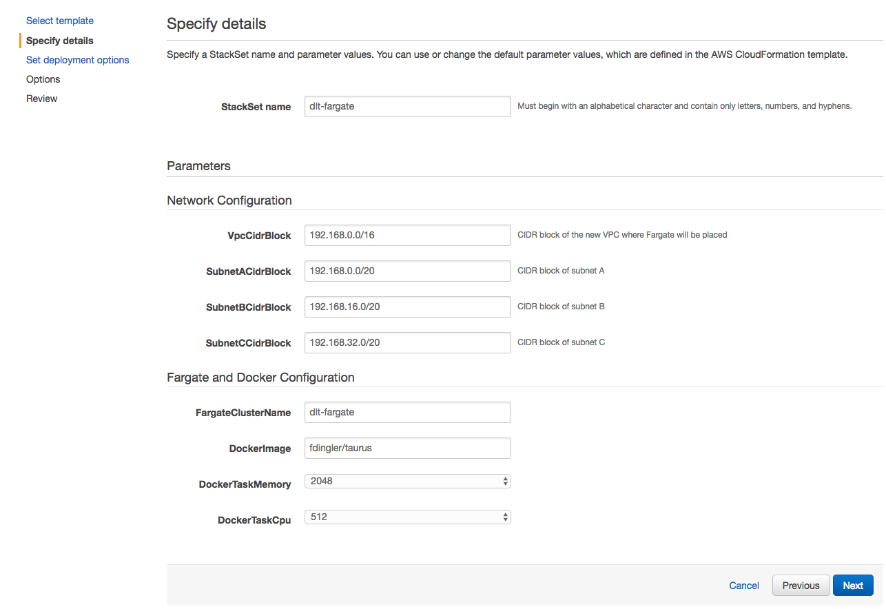

## Distributed Load Testing Using Fargate

Running performance load testing is extremely important to understand how your services will scale and behave once 
deployed to production. However, organizations tend to skip this type of testing because it can be challenging and 
time consuming to setup. One of the main challenges is how to simulate a scenario that mimics the load expected in 
a production environment; In a real world scenario, requests from users typically come from different geographic 
locations and are likely to come in parrallel. This repository is an example of how to setup a distributed load testing
infrastructure using AWS Fargate and the tesing tool Taurus. 


## License Summary

This sample code is made available under a modified MIT license. See the LICENSE file.

## Requirements

- Python 2.7
- Docker CLI
- Access to an AWS account
- A DockerHub account

## Getting Started

### 1. Clone this repository

```bash
git clone https://github.com/aws-samples/distributed-load-testing-using-aws-fargate.git
```

### 2. Modify the Taurus test scenario

Configure your test scenario by editing the `tests/my-test.yml` file.  
To can learn more about the syntax of this file, check the Taurus docs: https://gettaurus.org/kb/Index .

```yaml
execution:
- concurrency: 5
  ramp-up: 1m
  hold-for: 5m
  scenario: aws-website-test

scenarios:
  aws-website-test:
    requests:
    - http://aws.amazon.com
``` 

### 3. Build and publish the docker image

Once you have completed your test scenario. You need to package it in a Docker image and publish it
in the Docker Hub or in a private registry of your choice.  

For simplicity, I'm going to use the public Docker Hub. If you don't have an account, go ahead and create one in
https://hub.docker.com. Then login from the terminal:  

```bash
docker login
```

Once logged in, you can build the image running docker build from the root folder of this project.  

```bash
docker build -t your_docker_hub_user/dlt-fargate .
```

Now you can push the image to the registry

```bash
docker push your_docker_hub_user/dlt-fargate
```

### 4. Create the Fargate Clusters

Create the Fargate clusters in your AWS account by running the CloudFormation template in `cloudformation/main.yml` on
every region where you want to run tests from. This example works for `us-east-1`, `us-east-2` and `us-west-2`
but it should be easy to extend to extend the template to work on other regions.

**Note**: Make sure Fargate is available in the regions you want to run this from.
Here is a list of products by region: https://aws.amazon.com/about-aws/global-infrastructure/regional-product-services.  

The CloudFormation template will ask for a few basic parameters.  



- **DockerImage**. Specify the docker image that you published to the DockerHub.
- **DockerTaskCpu**. Number of CPU units to assign to the Fargate tasks ([Task Size Reference](https://docs.aws.amazon.com/AmazonECS/latest/developerguide/task_definition_parameters.html#task_size)).
- **DockerTaskMemory**. Memory in MB to assign to the Fargate tasks ([Task Size Reference](https://docs.aws.amazon.com/AmazonECS/latest/developerguide/task_definition_parameters.html#task_size))
- **FargateClusterName**. Name of your cluster so you can identiy it. 

The CloudFormation template will create everything needed to run Fargate on AWS; including the VPC, subnets,
security groups, internet gateway and route tables. 
 

### 5. Run the tests

Finally, edit the `bin/runner.py` python file to add the list of regions with its CloudFormation stack names that
you launched on the previous step. This python file will read the CloudFormation outputs and based on those parameters
will schedule the execution of the Fargate tasks.

Before running the python script, install boto3 by creating a virtual environment. Creating a virtual
environment is optional, but recommended.

If you don't have virtualenv installed, you can install it with pip. If you already have it, skip this step. 

```bash
pip install virtualenv
``` 

Create the virtual environment inside the `bin/` directory and activate it. 

```bash
cd bin/
virtualenv env
source env/bin/activate
``` 

Once inside the virtual environment, install the dependencies (boto3) by running:

```bash
pip install -r requirements.txt
```

And finally, when you are ready to run the Distributed Load Test, run the script.

```bash
python runner.py
```

### 6. Monitor the tests in CloudWatch

Work in progress
