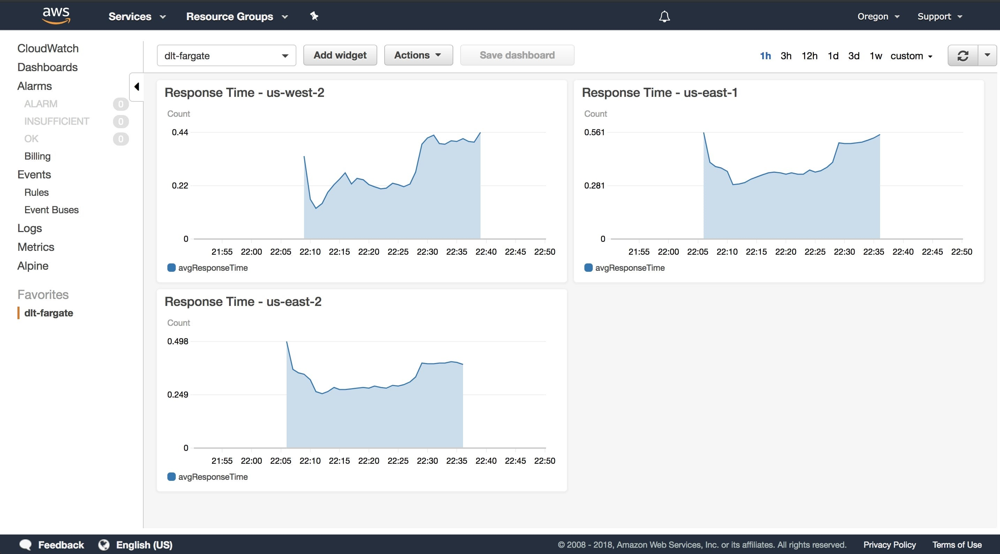

## Distributed Load Testing Using Fargate

This solution walks you through a prescriptive implementation of Distributed Load Testing using 
[Taurus (JMeter)](https://gettaurus.org) and [AWS Fargate](https://aws.amazon.com/fargate). You can use it to test your 
web services (system under test) under high stress scenarios and understand it's behavior and scalability. 


Taurus acts as a wrapper around JMeter and allows you to generate HTTP requests in parallel simulating a 
real-world scenario. This solution shows how to run Taurus on Docker containers and deploy them to Fargate clusters
running in different AWS regions, so that you can simulate requests coming from different geographic locations into 
your service. 

**Note**: Your service (system under test) does not have to be running on AWS. You can configure this solution to hit
any HTTP endpoint as long as it's accessible through the internet. However, this solution is meant to be deployed
on an AWS account. 

## License Summary

This sample code is made available under a modified MIT license. See the LICENSE file.

## Requirements

- Python 2.7
- Docker CLI
- Access to an AWS account
- A DockerHub account

## Getting Started

### 1. Clone this repository

```bash
git clone https://github.com/aws-samples/distributed-load-testing-using-aws-fargate.git
```

### 2. Modify the Taurus test scenario

Configure your test scenario by editing the `tests/my-test.yml` file.  
To can learn more about the syntax of this file, check the Taurus docs: https://gettaurus.org/kb/Index .

```yaml
execution:
- concurrency: 5
  ramp-up: 1m
  hold-for: 5m
  scenario: aws-website-test

scenarios:
  aws-website-test:
    requests:
    - http://aws.amazon.com
``` 

### 3. Build and publish the docker image

Once you have completed your test scenario. You need to package it in a Docker image and publish it
in the Docker Hub or in a private registry of your choice.  

For simplicity, I'm going to use the public Docker Hub. If you don't have an account, go ahead and create one in
https://hub.docker.com. Then login from the terminal:  

```bash
docker login
```

Once logged in, you can build the image running docker build from the root folder of this project.  

```bash
docker build -t your_docker_hub_user/dlt-fargate .
```

Now you can push the image to the registry

```bash
docker push your_docker_hub_user/dlt-fargate
```

### 4. Create the Fargate Clusters

Create the Fargate clusters in your AWS account by running the CloudFormation template in `cloudformation/main.yml` on
every region where you want to run tests from. This example works for `us-east-1`, `us-east-2` and `us-west-2`
but it should be easy to extend to extend the template to work on other regions.

**Note**: Make sure Fargate is available in the regions you want to run this from.
Here is a list of products by region: https://aws.amazon.com/about-aws/global-infrastructure/regional-product-services.  

The CloudFormation template will ask for a few basic parameters and will create everything needed to run Fargate on AWS; 
including a VPC, 3 public subnets in different AZs, a security group, an internet gateway, a route table, a CloudWatch
group, a CloudWatch Log Filter, an IAM role for the tasks, an ECS cluster and the Task Definition for Fargate.  


- **DockerImage**. Specify the docker image that you published to the DockerHub.
- **DockerTaskCpu**. Number of CPU units to assign to the Fargate tasks ([Task Size Reference](https://docs.aws.amazon.com/AmazonECS/latest/developerguide/task_definition_parameters.html#task_size)).
- **DockerTaskMemory**. Memory in MB to assign to the Fargate tasks ([Task Size Reference](https://docs.aws.amazon.com/AmazonECS/latest/developerguide/task_definition_parameters.html#task_size))
- **FargateClusterName**. Name of your cluster so you can identify it in the ECS Console.  

### 5. Run the tests

Finally, edit the `bin/runner.py` python file to add the list of regions with its CloudFormation stack names that
you launched on the previous step. This python file will read the CloudFormation outputs and based on those parameters
will schedule the execution of the Fargate tasks.

Before running the python script, install boto3 by creating a virtual environment. Creating a virtual
environment is optional, but recommended. If you don't have virtualenv installed, you can install it with pip. 

```bash
pip install virtualenv
``` 

Create the virtual environment inside the `bin/` directory and activate it. 

```bash
cd bin/
virtualenv env
source env/bin/activate
``` 

Once inside the virtual environment, install boto3 by running:

```bash
pip install -r requirements.txt
```

And finally, when you are ready to run the Distributed Load Test, run the script.

```bash
python runner.py
```

### 6. Monitor the tests in CloudWatch

The CloudFormation template should have created a [CloudWatch Metric Filter](https://docs.aws.amazon.com/AmazonCloudWatch/latest/logs/FilterAndPatternSyntax.html)
that will capture the average response time for each HTTP request that was issued to your system under test. You should
see something like this in the template:

```yaml
TaurusLogFilterAvgResponseTime:
  Type: AWS::Logs::MetricFilter
  Properties:
    FilterPattern: "[time, logType=INFO*, logTitle=Current*, numVu, vu, numSucc, succ, numFail, fail, avgRt, x]"
    LogGroupName: !Ref FargateTaskCloudWatchLogGroup
    MetricTransformations:
      -
        MetricValue: "$avgRt"
        MetricNamespace: "dlt-fargate/taurus"
        MetricName: "avgResponseTime"
```

What this filter is doing, is parsing the Taurus logs that match that given format and assigning a variable name to each
value in the log. We are going to ignore all values in the log except for `avgRt` which is captured as a new metric and 
stored in your CloudWatch Metrics. 

Once the filter is in place, I recommend to centralize the metrics from the different regions into a single CloudWatch
Dashboard. To pull metrics from different regions into one Dashboard [follow this steps](https://docs.aws.amazon.com/AmazonCloudWatch/latest/monitoring/cross_region_dashboard.html).
The Dashboard will look something like this:   




